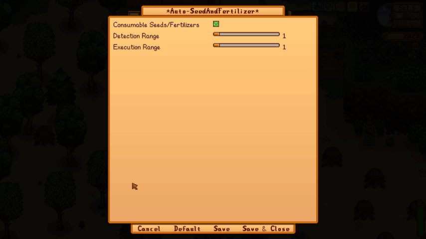

# Auto-Seed And Fertilizer

    

## Introduction
Preemptively mark tilled empty soils for placement of currently equipped seeds or fertilizers. Approach marked soils to automatically sow seeds or fertilizers.

## Requirements
- SMAPI 4.0.0+
- GenericModConfigMenu

## Usage
Equip a seed bag or a fertilizer. Hold right-mouse-button over a tilled soil to mark them. Move close to marked soils to automatically sow seeds or fertilizers in hand.

## Configuration
In Generic Mod Config Menu, you may choose to:
- **Consumable Seeds/Fertilizers**: Choose whether to allow consumption of equipped seeds or fertilizers.
- **Detection Range**: Widen the distance between player and a closest marked soil to trigger auto-sowing.
- **Execution Range**: Widen the area around the player that will modify marked soils within the area upon auto-sowing.
  

    

## Inspiration
[YunHikari](https://next.nexusmods.com/profile/YunHikari?gameId=1303)'s suite of Auto-Tools on [NexusMods](https://next.nexusmods.com/profile/YunHikari?gameId=1303).