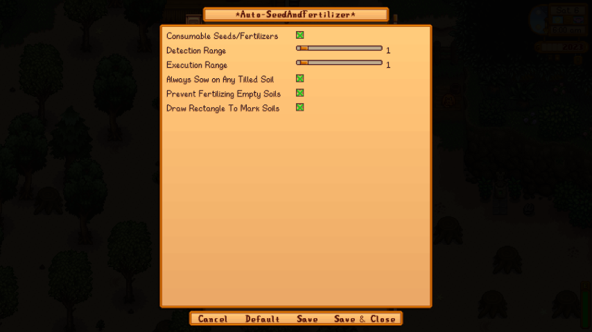

# Auto-Seed And Fertilizer

    

## Introduction
Preemptively mark tilled empty soils for placement of currently equipped seeds or fertilizers. Approach marked soils to automatically sow seeds or fertilizers.

[Download on **NexusMods**](https://www.nexusmods.com/stardewvalley/mods/29465)

## Requirements
- SMAPI 4.0.0+
- GenericModConfigMenu

## Usage

### Single-tile mode
Equip a seed bag or a fertilizer. Hold `right-mouse-button` over a tilled soil to mark them. Move close to marked soils to automatically sow seeds or fertilizers in hand.

    

### Rectangular Marquee mode
Equip a seed bag or a fertilizer. Hold `right-mouse-button` over a whole field to mark tilled soils within the rectangular area. Move close to marked soils to automatically sow seeds or fertilizers in hand.

    

### Always Sow on Any Tilled Soil mode
Skip manually marking tilled soils. Instead, simply walk over the tilled soils to sow seeds/fertilizers.

## Configuration
In Generic Mod Config Menu, you may choose to:
- **Consumable Seeds/Fertilizers**: Choose whether to allow consumption of equipped seeds or fertilizers.
- **Detection Range**: Widen the distance between player and a closest marked soil to trigger auto-sowing.
- **Execution Range**: Widen the area around the player that will modify marked soils within the area upon auto-sowing.
- **Always Sow on Any Tilled Soil**: Skip manually marking tilled soils. Instead, simply walk over the tilled soils to sow seeds/fertilizers.
- **Prevent Fertilizing Empty Soils**: Always ensure that the tilled soil is already occupied before allowing fertilizers to be sowed.
- **Draw Rectangle To Mark Soils**: Instead of selecting one tile at a time, draw a rectangular area to mark tilled soils.
  

    

## Inspiration
[YunHikari](https://next.nexusmods.com/profile/YunHikari?gameId=1303)'s suite of Auto-Tools on [NexusMods](https://next.nexusmods.com/profile/YunHikari?gameId=1303).